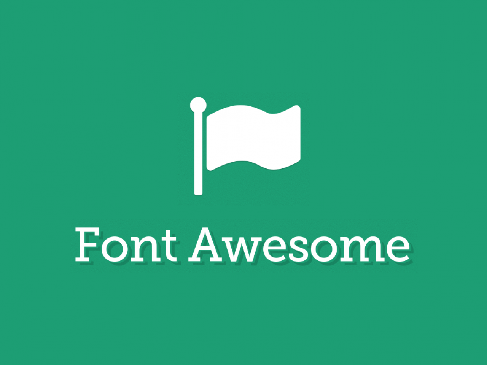

# JavaScript Module Clearence Test Projects.
### Welcome to my Repo! This Repo contains all the tasks completed by TEAM 1.

---

## Hosted Link: [Click Here](https://shivambansal96.github.io/Team_1_Geekathon/Homepage_By_Shivam/)

## Table of Contents:-
1. [Introduction](#introduction)
2. [Mentor and Guide](#project)
3. [Team members](#project)
4. [Technologies Used](#technologies-used)
5. [Challenges Faced](#challenges-faced)
---

## Introduction:
This Repo contains all the assignments given by **Geekster** to the members of team 1 during Geekathon, as a **Module Clearence Test (MCT)** of **Module 4** which was conducted from 9th Feb to 13th Feb, 2024.
---

## Our Mentor and Guide :-

 - Srivatsa Damaraju - [Stalk the Mentor](https://www.linkedin.com/in/srivatsa-damaraju/)

## Team Members :-

- This project was assigned by [Geekster](https://www.geekster.in/) as a **Module Clearence Test** for a team of 10 members:

## Active Members:

(i) Janvi Shah (TEAM LEAD) - [Resume Template](https://shivambansal96.github.io/Team_1_Geekathon/Resume_Template_by_Janvi/view/)  
(ii) Shivam Bansal - [Chrome Extension](https://shivambansal96.github.io/Team_1_Geekathon/Chrome_Extension_by_Shivam/)  
(iii) Hemant Dubey - [Invoice Generator](https://shivambansal96.github.io/Team_1_Geekathon/Invoice_Generator_by_Hemant/)  
(iv) Sourasish Sengupta - [Payment Integration](https://shivambansal96.github.io/Team_1_Geekathon/Payment_Integration_by_Sourasish/)  
(v) Uddesh Pujari - [Typing Speed Test Game](https://shivambansal96.github.io/Team_1_Geekathon/Typing_Speed_Apk_Uddesh)  

## Inactive Members:

(i) Mayank Middha - [Trello Clone](https://shivambansal96.github.io/Team_1_Geekathon/Trello_by_Mayank/)  
(ii) Ankush Rajput - [Code Editor](https://shivambansal96.github.io/Team_1_Geekathon/Code_Editor_by_Ankush/)  
(iii) Prateek Saini - [MineSweeper Game](https://shivambansal96.github.io/Team_1_Geekathon/prateek/)  
(iv) Amit Agarwal - [Flipkart Sort & Filter](https://shivambansal96.github.io/Team_1_Geekathon/Amit/)  
(v) Yogesh - [Chrome Extension](https://shivambansal96.github.io/Team_1_Geekathon/Yogesh/)

## Technologies Used:      

1.  **HTML:**  
  - Used for structuring the web pages including heading, content sections, and footers.

2.  **CSS:** 
 - Applied for styling and layout.
   
3.  **JS - JavaScript**
 - Used for styling and adding functionalities on the page.
   
 4.  **Font Awesome (for icons)**
 - Description: Font Awesome is a comprehensive icon library that offers a vast selection of icons for various purposes, such as user interface design, web development and graphic design.
 - Usage:
   - Include the CSS: Add the Font Awesome CSS stylesheet to your HTML document by including a link in the <head> section.
   - Add Icons: Insert icons into your HTML using the element with the appropriate class. Customize their appearance using CSS.
   - Customize Icons: You can modify icons' size, color, and alignment by adding extra classes and applying CSS styles.
   - Explore Icons: Visit the Font Awesome website or documentation to find the icons that suit your project's needs.
 - Documentation: [Official documentation for further details.](https://fontawesome.com/)

## Challenges Faced:
Throughout the development of our Apple Website,  our team encountered various challenges and obstacles. Some challenges are listed below:

 **Challenge 1 - Complex Layouts:** 
   
  - Apple's website often features complex and dynamic layouts. Recreating these layouts with HTML and CSS while maintaining responsiveness was very be challenging.

 **Challenge 2 - Responsive Design:**
   
  - Apple's website is designed to work seamlessly across various devices and screen sizes. Ensuring that your clone is responsive and looks good on desktops, tablets, and mobile devices was a significant challenge.

 **Challenge 3 - Interactive Elements:**
   
  - Apple's site incorporates numerous interactive elements, such as sliders, carousels, and dynamic content. Ensuring that with the use of innovative animation it makes the pages look like a replica of the main Apple UI especially the navbar with the drop-down and the sidebar.
      
 **Challenge 4 - Team Collaboration:**
 
 - Coordinating tasks among team members and ensuring smooth version control throughout the project proved to be a challenge.

 - Regular team meetings and communication channels, such as zoom/ google meet, facilitated collaboration and issue tracking.
---

## Project Overview

This repository is a curated collection of assignments, each designed to showcase specific skills, techniques, and technologies across various domains. Below is a brief overview of each project contained within this repository:

### Chrome Extension

- **Purpose**: Enhances the browsing experience with features like quick access to favorite sites, ad-blocking, and theme customization.
- **Key Features**: Customizable dashboard, ad-blocking functionality, dark mode.
- **Technologies Used**: HTML, CSS, JavaScript.

### Payment Integration

- **Purpose**: Demonstrates the integration of a secure payment system into a web application, facilitating seamless online transactions.
- **Key Features**: Support for multiple payment methods, real-time transaction updates, and transaction history.
- **Technologies Used**: PHP, JavaScript, Stripe API (or any other payment service provider API).

### Resume Template

- **Purpose**: Offers a professionally designed resume template that stands out to employers, easily customizable to fit individual career profiles.
- **Key Features**: Modern design, editable sections for skills, experience, and education, compatible with PDF and Word formats.
- **Technologies Used**: Microsoft Word, Adobe PDF.

### Code Editor

- **Purpose**: Provides a lightweight, browser-based code editor for quick edits and previews of web development projects, supporting syntax highlighting for multiple programming languages.
- **Key Feature**:  Real-time code execution, syntax highlighting for HTML, CSS, JavaScript, and other popular languages, theme customization.
- **Technology Used**: Technologies Used: HTML, CSS, JavaScript, potentially leveraging libraries like CodeMirror or Ace for the editor component.

### Invoice Generator
 = **Purpose**: Facilitates the creation, customization, and sending of invoices, streamlining the billing process for freelancers and small businesses.
 - **Key Features**: Customizable invoice templates, automatic calculations of totals, options to send directly to clients via email, and PDF export functionality.
 - **Technologies Used**: HTML, CSS, JavaScript for frontend; Node.js, Express, and PDF libraries (e.g., pdfkit) for backend functionalities.

### Trello Clone
 - **Purpose**: Implements a simplified version of the popular project management tool, Trello, enabling users to organize tasks into boards, lists, and cards.
 - **Key Features**: Drag-and-drop interface for organizing tasks, options to create multiple boards, lists, and cards, ability to assign tasks and set deadlines.
 - **Technologies Used**: React for the frontend to manage state and provide an interactive UI, Node.js and Express for backend services, and MongoDB or another database for data storage.
   
### Typing Speed Test Game
 - **Purpose**: Offers a fun and interactive way to improve typing speed and accuracy by challenging users to type out given passages within a time limit.
 - **Key Features**: Real-time typing speed and accuracy tracking, variety of difficulty levels and text passages, leaderboard to compare scores with others.
 - **Technologies Used**: HTML, CSS, JavaScript for the game logic and UI, with the option to use a backend like Node.js to store high scores and manage leaderboards.

Each project in this repository serves as a practical example of applying specific technologies to solve real-world problems or enhance user experience in various ways. Whether you're looking to improve your web development skills, understand payment integration, or create a compelling resume, these assignments offer valuable insights and tools to achieve your goals.
