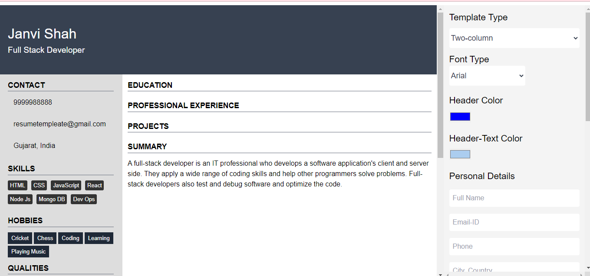

<h1 align="center">Resume-Builder</h1>

## Description:
The project **"Resume-builder"** is an online open-source resume builder. It is very easy to and the resume can be built within minutes. The required input fields are entered by the user, and then based on the details, the Resume is generated. Currently, it supports only 2 templates. Highly inspired from Overleaf resume and novoresume.

## Purpose:
This project helps to organize thoughts and ensures that everything is filled in its appropriate place. It helps to remember important details that should be on the resume, making sure that nothing important is left out. It is also a time-saving advantage if there is a need for applying for more than one job.

## Website is Live at:
https://shivambansal96.github.io/Team_1_Geekathon/Resume_Template_by_Janvi/view/

## Built With:
 - HTML.
 - CSS.
 - Javascript.
 - Tailwind CSS.
 - html to pdf converter library.

## Developed By:
<h2 align="center">Janvi Shah</h2>

